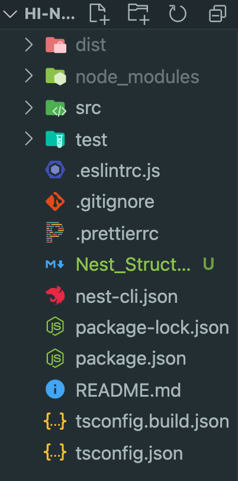
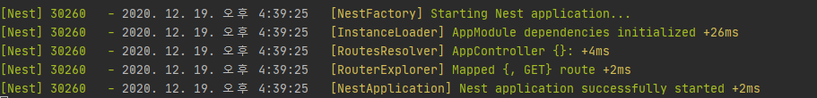

# 🐱 Nest.js
* express 기반으로 제작되었으며, node.js에 백엔드를 구성할 수 있도록 해준다.
 

* 기본적으로 typescript를 지원하며, javascript로 어플리케이션을 작성하는 것도 가능하다.
 

* ES7(혹은 타입 스크립트)에 새로 추가된  @ 데코레이터(Decorator)를 주로 이용한다.
 

* nest.js는 **구조**라는 것을 갖고 있고, 그 구조 덕분에 순서와 룰도 있어서 이를 따르기만 하면 큰 규모의 백엔드를 쉽게 만들 수 있다.(미리 셋팅된 여러 기능들을 제공하기 때문에 수동으로 생성하지 않아도 된다.)
 

* node.js 어플리케이션을 빌드하는데 유용하며, **객체지향 프로그래밍**(Object Oriented Programming)과 **함수형 프로그래밍**(Functional Programming), **함수 반응형 프로그래밍**(Functional Reactive Programming)의 요소도 일부분 사용한다.

## 🎮 Controller

    

Controller는 기본적으로 url을 가져오고 함수를 실행한다.(express의 router와 같은 역할을 한다.)
* **app.controller.ts** : 간단한 경로가있는 기본 컨트롤러.
Nestjs는 기본적으로 컨트롤러(Controller)를 통해 **라우팅**(Routing)을 구현한다.
 

* **app.service.ts** : 간단한 서비스. (화면에 표시되는 Hello World가 있는 부분)
 

* **app.module.ts** : 애플리케이션의 루트 모듈.
`최상위라면 밑으로 자식모듈들을 import 가능하다고 생각 할 수 있겠네요 😮`
 

* **main.ts** : 핵심 기능 NestFactory을 사용하여 Nest 애플리케이션 인스턴스를 생성하는 애플리케이션의 항목 파일.

## 프로젝트 실행하기

    

프로젝트를 실행하면 teminal에 로그메세지가 뜨면서 어플리케이션이 실행되는 것을 확인 할 수 있습니다.

    1. Nest Application을 시작합니다.
    2. InstanceLodder는 각각의 Module에 대해 Controller, Injectable, Provider를 초기화 해줍니다.
    3. RouteResolver는 Controller의 path 정보를 추출해서 생성자로 주입받은 routerExplorerroute의 explore Method를 통해서 path에 대해서 Mapping 해줍니다.